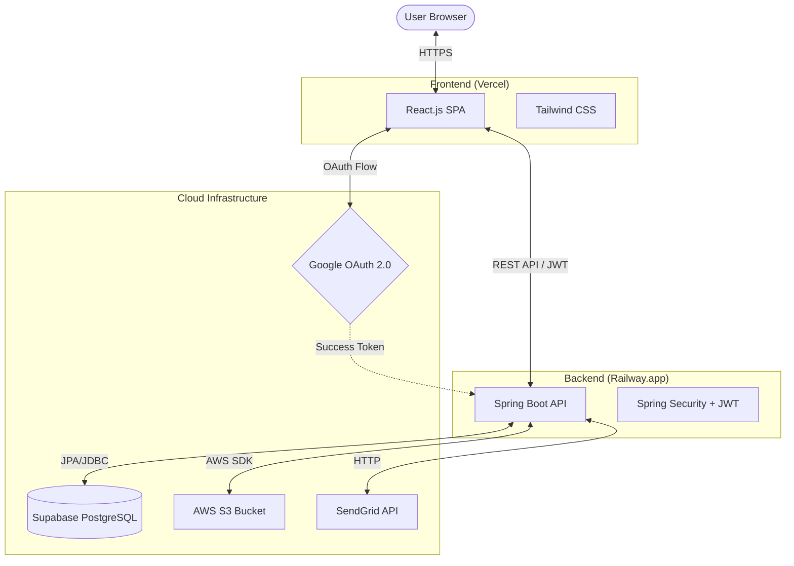

# ☁️ CloudBox: Unified Multi-Modal Distribution Hub

**CloudBox** is a high-performance, secure, and persistent cloud storage solution built with a modern stack. It allows users to store, share, and manage multi-modal files (images, videos, documents) with ease, featuring cloud-native persistence and real-time notifications.

---

## 🚀 Live Links
- **Frontend (Vercel):** [https://mega-project-5-cloud-based-meta-fil.vercel.app/login)
- **Backend (Railway):** [melodious-curiosity-production.up.railway.app](https://melodious-curiosity-production.up.railway.app)

---

## 🏗️ System Architecture



---

## ✨ Key Features

### 🔐 Security & Identity
- **Google OAuth 2.0:** One-tap secure login using Google.
- **JWT Authentication:** Secure API access with JSON Web Tokens.
- **Role-Based Access:** Private, Public, and Restricted file sharing permissions.

### 📁 File Management
- **Cloud Persistence:** Powered by **AWS S3**. Files are safe from server redeployments and handle large volumes effortlessly.
- **Streaming:** High-performance video and image preview/streaming directly from cloud buckets.
- **Trash & Stars:** Built-in trash management (restore/permanent delete) and starred items for quick access.
- **Folder Structure:** Organize your files with nested folders.

### 📧 Sharing & Collaboration
- **Unified Sharing Link:** Generates a secure "Private Public Link" for every shared file.
- **Automatic Email Notifications:** Powered by **SendGrid API**. Recipients get instant email invites with direct access buttons.
- **Internal Sharing:** Seamless file sharing between registered system users.

### 📊 Dashboard
- **Storage Metrics:** Live tracking of storage usage.
- **Search:** Instant search across filenames and types.

---

## 🛠️ Tech Stack

- **Frontend:** React.js, Tailwind CSS, Vite
- **Backend:** Java, Spring Boot, Spring Security (JWT)
- **Database:** Supabase (PostgreSQL)
- **Cloud Storage:** AWS S3 (Scalable storage for large files)
- **Deployment:** Vercel (Frontend), Railway (Backend)
- **Email Service:** SendGrid API
- **Version Control:** Git & GitHub

---

## ⚙️ Environment Variables (Production)

To run this project in production, the following variables must be set on your hosting platforms (Railway/Vercel):

### Backend (Railway)
| Variable | Description |
| :--- | :--- |
| `SPRING_DATASOURCE_URL` | Supabase PostgreSQL Connection String |
| `SPRING_DATASOURCE_USERNAME` | Supabase DB Username |
| `SPRING_DATASOURCE_PASSWORD` | Supabase DB Password |
| `AWS_ACCESS_KEY` | Your AWS IAM Access Key |
| `AWS_SECRET_KEY` | Your AWS IAM Secret Key |
| `AWS_REGION` | Your S3 Bucket Region (e.g., ap-south-1) |
| `AWS_S3_BUCKET` | Your S3 Bucket Name |
| `SENDGRID_API_KEY` | Your SendGrid API Key (SG...) |
| `FRONTEND_URL` | Your Vercel domain |
| `JAVA_TOOL_OPTIONS` | `-Xmx300m -Xms256m` (Memory management) |
| `GOOGLE_CLIENT_ID` | From Google Cloud Console |
| `GOOGLE_CLIENT_SECRET` | From Google Cloud Console |

### Frontend (Vercel)
| Variable | Description |
| :--- | :--- |
| `VITE_API_URL` | Your Railway Backend URL |

---

## 📐 Architecture & Challenges
Developing this project involved overcoming significant technical hurdles including **CORS nightmares**, **Ephemeral storage issues**, and **SMTP delivery blocks**.

For a detailed deep-dive into the technical battles fought during development, check out:
👉 **[CHALLENGES.md](./CHALLENGES.md)**

---

## 🧑‍💻 Local Setup

1. **Clone the repository:**
   ```bash
   git clone <repo-url>
   ```
2. **Setup Backend:**
   - Configure `application.properties` with your local DB/Supabase credentials.
   - Run `./mvnw spring-boot:run`
3. **Setup Frontend:**
   - Run `npm install`
   - Run `npm run dev`

---

## 📄 License
This project is made by **SAURABH BISWAL** for educational purposes. Feel free to use and add more features to it!
